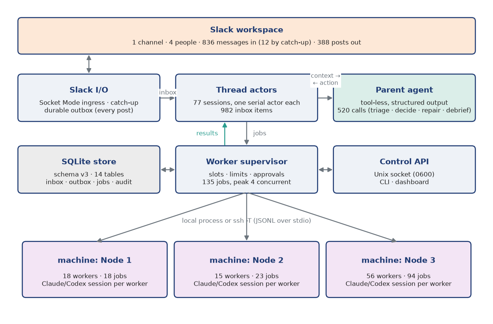

Overview
========

Purpose
-------

Fridica is a daemon that acts in Slack on behalf of one owner. It listens to the channels the owner
configures, and for each message decides whether the owner would take part. When it does, it writes a
reply in the owner's voice. When the answer requires work (reading a repository, running tests,
changing code, producing a figure), it hands that work to *workers*: Claude Code or Codex sessions that
run on one of the owner's machines, in a named workspace, under that machine's policy. A worker's
result comes back as a compact structured report, and Fridica turns it into the next Slack message.

Several owners may run their own Fridica in the same channel, so the design treats other agents as
first-class participants. Their posts carry machine-readable metadata, and every instance applies the
same loop-protection rules.

The one-paragraph design
------------------------

A tool-less *parent* agent coordinates each Slack thread. It never runs commands; it only returns
a structured decision (reply, delegate, control workers, update the thread's memory). Each thread is a
*thread session* served by exactly one serial *thread actor*, so threads proceed in parallel without
interfering and each thread sees its events strictly in order. Workers are the only place where tools
run. Each worker is bound at creation to one machine, one workspace and one backend, which makes the
questions "where does this run" and "what may it touch" properties of the machine registry rather
than of the prompt. SQLite is the single durable queue between all of these pieces: incoming
messages, per-thread inbox items, jobs, results and outgoing posts are rows, and every step commits
its effects atomically.

   Architecture of the current design with live counts from the state database: Slack traffic
   enters through Socket Mode (plus a periodic catch-up), is routed to per-thread actors, which
   consult the parent and delegate jobs to workers on the machines of the registry. All posts leave
   through the durable outbox.

Goals and non-goals
-------------------

Goals:

* **Behave like the owner, conservatively.** Answer when addressed; stay quiet when unsure; never
  loop with another agent.
* **Put work where the resources are.** Code, data, toolchains and GPUs live on specific machines;
  workers run there, with nothing but the protocol stream crossing SSH.
* **Keep the coordinator's context small and trustworthy.** The parent sees summaries and structured
  results, never raw tool output.
* **Survive crashes without duplicates.** Nothing is posted twice, nothing silently lost, nothing
  half-applied.
* **Make the owner's authority explicit.** Sandboxes, approvals and policies are configuration,
  inspectable in the dashboard, not conventions in a prompt.

Non-goals: being a general Slack bot for a team (Fridica speaks for one person), hosting models
(the backends are the vendors' CLIs), and replacing a batch scheduler (a Slurm transport exists only
as a stub).

Data sets used in this document
-------------------------------

The statistics come from two SQLite files. The current database has been written by the overhauled
daemon since PR #22 was deployed. The legacy database is the backup that the overhaul left in place
when it created a new schema. Both are read through the SQLite backup API into a private snapshot, so
the running daemon is never locked.

.. include:: generated/t1_datasets.rst

In the current period the owner's channel saw |messages| stored messages from |people| distinct
people (anonymized as *owner* and *person A, B, …*), in |channels| configured channel(s) and
|threads| threads. Fridica made |parent_calls| parent calls, created |workers| workers and ran |jobs|
jobs on |machines| machines, and posted |posts| times.
