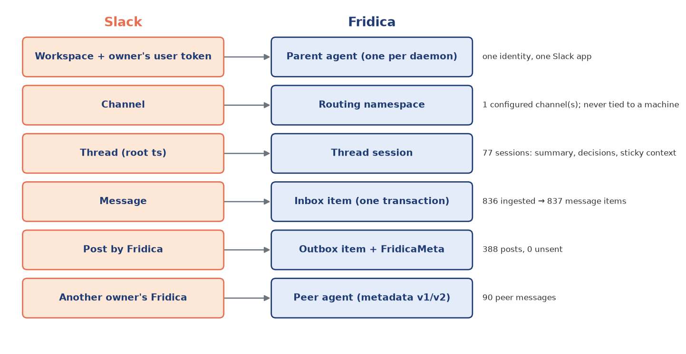
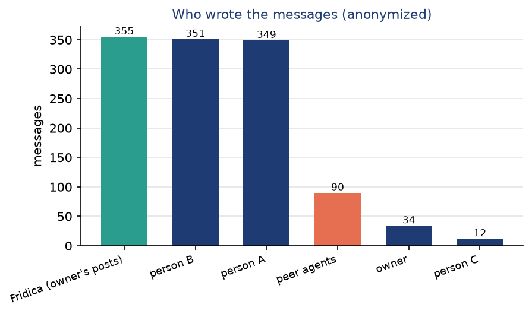

Mapping Slack concepts to the runtime
======================================

The central design decision of the overhaul is that Slack's own structure *is* the structure of the
agent system. Each Slack concept maps to exactly one runtime object with one owner in the code, and the
mapping is visible in the database schema.

   Slack concepts (left) and the runtime objects they become (right), with the number of each in the
   current database.

.. list-table:: The mapping in detail
   :header-rows: 1
   :widths: 17 23 60

   * - Slack concept
     - Fridica object
     - Role and invariants
   * - Workspace
     - The daemon and its parent agent
     - One daemon serves one owner in one workspace. The owner's user token posts, so replies appear
       under the owner's name; the app-level token only opens Socket Mode. The owner and workspace IDs
       are bound in ``meta`` when the database is created, so a database cannot be reused for another identity.
   * - Channel
     - Routing namespace and policy scope
     - Only configured channels are processed. ``delegate_channels`` limits which channels may start
       worker jobs; channel context (the last messages before a new thread) is read only for threads
       Fridica has not yet joined; a per-channel cooldown paces unsolicited replies.
   * - Thread (root ``ts``)
     - Thread session + thread actor
     - The key is (workspace, channel, root_ts). A top-level message starts a session keyed by its own
       ``ts``. The session holds control state (active, paused, closed, archived, cleaned), status of
       the last reply (complete, waiting, blocked, working), counters, the rolling summary, recent
       decisions, sticky context (machine, workspace, repo, branch), and its workers.
   * - Message
     - ``messages`` row + ``thread_inbox`` item
     - Stored once, unique by (channel, ts), whether it came from Socket Mode or the catch-up. Every
       new message becomes an inbox item of its thread; the actor gates it before any model call.
   * - Mention ``<@owner>``
     - Addressing signal
     - A mention, or a reply to a question Fridica asked (status *waiting*), makes the thread respond
       without a triage call.
   * - Message metadata
     - ``FridicaMeta`` (v2; v1 read)
     - Every post carries ``event_type = fridica_message`` with owner, session, turn, status, kind and
       worker. Other owners' Fridicas use it for loop protection; Fridica uses it to recognize them.
   * - Post
     - ``outbox`` item
     - Replies, reports, notices, debriefs and uploads are all outbox rows with an idempotency key,
       sent in per-thread order; a sent post is recorded as a ``self`` message.
   * - File upload
     - ``outbox`` item of kind *upload*
     - Long replies overflow into a ``details-….md`` file; validated worker artifacts (PNG, PDF,
       Markdown) are uploaded after the reply they belong to.
   * - Channel post (top level)
     - Debrief
     - When a discussion finishes, a short debrief is posted to the channel, ordered after the final
       thread reply.

The thread as the unit of everything
------------------------------------

A Slack thread is the natural unit of a conversation: it has a beginning, participants, and an end. The
overhaul makes it also the unit of **ordering** (one actor, one inbox, strict order), of **memory** (the
rolling summary, decisions and sticky context belong to the session), of **work** (workers belong to a
session and are stopped when it closes), and of **control** (the owner pauses, resumes, closes, archives
or cleans a thread from the dashboard). A thread never waits for another thread, and no thread can
see another thread's workers or memory.

Turns, status and loop protection across owners
-----------------------------------------------

Several Fridicas can share a thread. Three rules, all pure functions in ``threads/policy.py``, keep two
agents from talking to each other forever:

1. **A shared turn counter.** Each post carries the thread's turn number in its metadata; a message
   from another agent advances the local counter to at least the peer's turn. Counters only grow.
2. **Finished replies end the exchange.** A peer's post with status *complete* or *blocked* is ignored
   unless it mentions the owner or answers a question Fridica asked. Another agent's debrief is always
   ignored, and unaddressed agent messages never reach a model.
3. **Stall detection instead of a turn limit.** A thread pauses after ``max_wait_replies`` consecutive
   replies that needed more information, or after ``max_no_progress`` turns without progress (no reply
   and no delegation, an identical reply, or a mere acknowledgment). The owner resumes it.

The legacy design capped every thread at a fixed number of turns and then wrote a "wrap-up". The
overhaul removed the cap: long, productive threads continue, while loops are detected by what they
look like.

In the current period |peer_msgs| messages came from peer agents; none started a loop.

Getting every message: Socket Mode plus catch-up
------------------------------------------------

Socket Mode drops events while the daemon is down or reconnecting, and occasionally while connected.
Fridica therefore rereads the last hour of each channel at start and the last fifteen minutes every
five minutes. Messages already stored are ignored by the (channel, ts) uniqueness constraint, so the two
paths cannot duplicate work.

   Stored messages by source and by (anonymized) sender. Of |messages| messages, |socket_msgs| arrived
   through Socket Mode, |catchup_msgs| were recovered by the catch-up, and |self_msgs| are Fridica's own
   posts recorded by the outbox.

Self-echo handling
~~~~~~~~~~~~~~~~~~

Fridica posts with the owner's user token, so its own posts come back through Socket Mode as messages
from the owner. The outbox records each successful post as a ``self`` message before the echo arrives;
the echo then collides with the stored row and is dropped. Messages from the owner that are *not*
generated are observed (the owner speaking for themselves is context, not a request).
