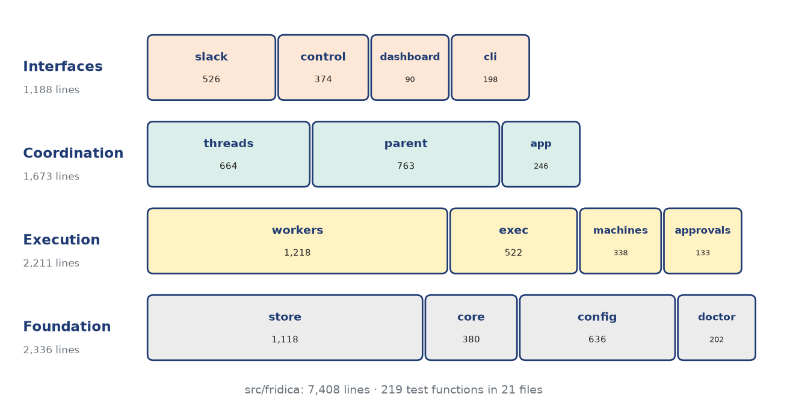

Layers of the design
====================

The code is organized as four layers. Dependencies point downward only: interfaces call coordination,
coordination calls execution through narrow protocols, and everything shares the foundation. The
composition root ``app.py`` is the only module that knows all of them; it wires the store, Slack
clients, parent, actors, supervisor and control API together and owns recovery and hot reload of the
configuration.

   The four layers and their packages, with lines of code per package (|lines| lines in total).

.. include:: generated/t3_packages.rst

Interfaces: Slack I/O, control API, dashboard, CLI
--------------------------------------------------

**Slack ingress** (``slack/ingress.py``, ``slack/catchup.py``) turns Events API payloads into immutable
``Message`` values and rejects everything else (unknown subtypes, malformed timestamps, bot posts
without a user). A post made through a user token by an app that also has a bot user carries both
``user`` and ``bot_id``; that is how other owners' Fridica replies arrive, so such posts are kept and
attributed to the user. The ingress path does exactly one thing with a message: store it and add an
inbox item to its thread, in one transaction, then ring the thread's doorbell.

**Slack egress** (``slack/egress.py``, ``slack/outbox.py``, ``slack/render.py``) is the only code that
posts. The parent's reply is rendered (known participants' IDs become mentions, the requester is
addressed when Fridica is waiting for an answer, and overflow beyond ``reply_chars`` moves into a
details file) and committed as an outbox row. The dispatcher sends due rows in per-thread order.

**Control API and dashboard** (``control/``, ``dashboard/``). The daemon serves JSON over HTTP on a Unix
socket with mode 0600. The CLI and the dashboard never write the database; every change (pause a
thread, answer an approval, instruct a thread, change limits) is a request to the daemon, which applies
it in its own transaction and wakes the component concerned. The dashboard is a static page plus an
authenticated, allowlisted proxy to that socket (see the security section). Its *attention* view
(``GET /attention/threads``) lists the threads that need the owner: paused threads and active threads
whose last reply was *blocked*.

**CLI and doctor** (``cli/``, ``doctor/``). ``fridica init`` discovers the Slack identity from the user
token and writes a commented configuration; ``doctor`` probes every backend on the machine where it
will run (through SSH for remote machines), checks sandboxes and GPU visibility, and never calls a
model.

Coordination: threads and the parent
------------------------------------

**Thread manager and actors** (``threads/``). The manager starts one actor task per thread that has
pending inbox work. An actor claims its thread's oldest pending item, handles it, and commits the
whole outcome (session update, posts, new workers, jobs, the parent-call records, and the item leaving
the inbox) in a single transaction. Six kinds of inbox items exist: ``message``, ``worker_result``,
``worker_interrupted``, ``control`` (owner actions), ``owner_instruction`` (private direction from the
dashboard) and ``debrief``.

Before a model is involved, the pure function ``policy.gate`` classifies each message:

* *ignore*: Fridica's own post, or another agent's message not addressed to the owner;
* *observe*: keep as context only (the owner wrote, the thread is paused, observe-only mode, not addressed);
* *notice*: a mention in a blocked thread, answered with a fixed notice once per blocked period;
* *triage*: a follow-up in a thread Fridica takes part in, or an unaddressed message when
  ``general_messages`` is on and the channel is not cooling down; a cheap triage call decides;
* *respond*: a mention, or an answer to Fridica's question; goes straight to the decision call.

**Parent** (``parent/``). Three kinds of calls, each one stateless and tool-less, run through the local
Claude or Codex CLI with a JSON schema:

* ``triage`` returns *ignore*, *observe* or *respond* from the last 15 messages and the summary;
* ``decide`` returns an **action**: ``reply`` (send, text, details, status, discussion), ``delegate`` (up
  to ``max_delegations_per_turn`` jobs, each continuing a worker of the thread or creating one from a
  machine name or capability tags, a workspace, backend, role, ephemerality, brief and deliverable),
  ``worker_control`` (interrupt or stop), ``context`` (sticky machine, workspace, repo, branch),
  ``summary``, ``decisions`` and a task ``note``;
* ``debrief`` writes the channel debrief for a finished discussion.

The action is validated against the thread's world (``parent/actions.py``). Unknown workers, stopped
workers, machines or workspaces that do not exist, a thread over ``max_workers_per_thread`` live
workers, or delegation in a channel that does not allow it are collected as errors and sent back for
**one repair round**, with the previous answer. What survives validation is applied; nothing the model
invents can name a machine outside the registry. A standing, owner-editable *contract*
(``parent/contract.py``) supplies the rules for triage, the parent and every worker, and a shared
repository list (``parent/repos.py``) tells both where each project lives and who owns it.

Execution: workers, supervisor, transports, machines
----------------------------------------------------

**Machine registry** (``machines/``). Every execution environment is declared under
``[machines.<name>]``: transport (local, ssh, slurm), host, capability tags (``cuda``, ``linux``, a GPU
model …), installed backends, named workspaces (a root path, optional ``subfolders``, and a policy), and
resources (CPUs, GPUs, ``max_jobs`` slots, ``max_workers`` processes). The parent never constructs an SSH
command. It names a machine or tags and a workspace, and ``machines/match.py`` resolves this selector to
a placement. Precedence is an explicit machine, then capability tags, then the thread's sticky
machine; among tag matches the sticky or default machine is preferred, then the least busy one
relative to its ``max_jobs``.

.. include:: generated/t12_machines.rst

**Workers** (``workers/``). A worker is a long-lived agent process speaking JSONL on stdio. The Claude
adapter runs ``claude -p`` with stream-json input and output. The Codex adapter runs
``codex app-server`` (JSON-RPC over JSONL, one Codex thread per worker, one turn per job). Each job ends
with a structured **WorkerResult** (next section). The backend session ID is persisted, so a later job
continues the same conversation even in a fresh process. An idle timer closes processes that receive no
follow-up.

**Supervisor** (``workers/supervisor.py``). Jobs are rows. The scheduler starts queued jobs while
respecting one job per worker, ``max_jobs`` per machine and globally, and ``max_workers`` live processes
per machine (evicting idle ones first). A finished job writes its result, its artifacts and a
``worker_result`` inbox row in one transaction: workers never talk to the parent directly. Each worker
has a sticky *slot* on its machine; with ``subfolders`` on, slot *k* works in ``<root>/worker<k>`` and
sees only its share of the machine's GPUs.

**Transports** (``exec/``). ``local`` runs a process here. ``ssh`` runs ``ssh -T host 'exec sh -c …'``
over a multiplexed ControlMaster connection, so the agent runs on the remote machine next to its files
and GPUs, and stdin and stdout carry the protocol unchanged. A small *watchdog* around every remote
agent (a FIFO held by the SSH channel and a ``setsid`` process group) kills the agent's whole process
group when the channel closes, so a stopped daemon or a dropped connection never leaves orphans.
``slurm`` is registered and validated but not runnable yet.

Foundation: store, core, config
-------------------------------

**Store** (``store/``). One SQLite database in WAL mode, owned by one daemon (an exclusive lock file).
``store/schema.py`` is the only module that runs DDL. Its migrations are versioned and each runs in one
transaction with the version bump: v1 created the schema, v2 added retry ``attempts`` to inbox items,
v3 added the worker ``slot``. Each table has one repository class, and ``Store.recover`` settles work a
previous daemon left in flight.

.. include:: generated/t4_schema.rst

**Core** (``core/``). Immutable value types (messages, sessions, workers, jobs, results, posts),
errors, an injectable clock, and the *doorbell bus*. SQLite is the queue; a doorbell only wakes the
component that should look, so a lost ring costs latency, never work.

**Config** (``config/``). A typed schema that holds the single set of defaults, a loader that enforces
every cross-field rule in one place, an editor used by the dashboard's ``PATCH /config/…`` endpoints,
and Slack discovery for ``init``. The daemon reloads the configuration when the file changes.

.. include:: generated/t10_defaults.rst
