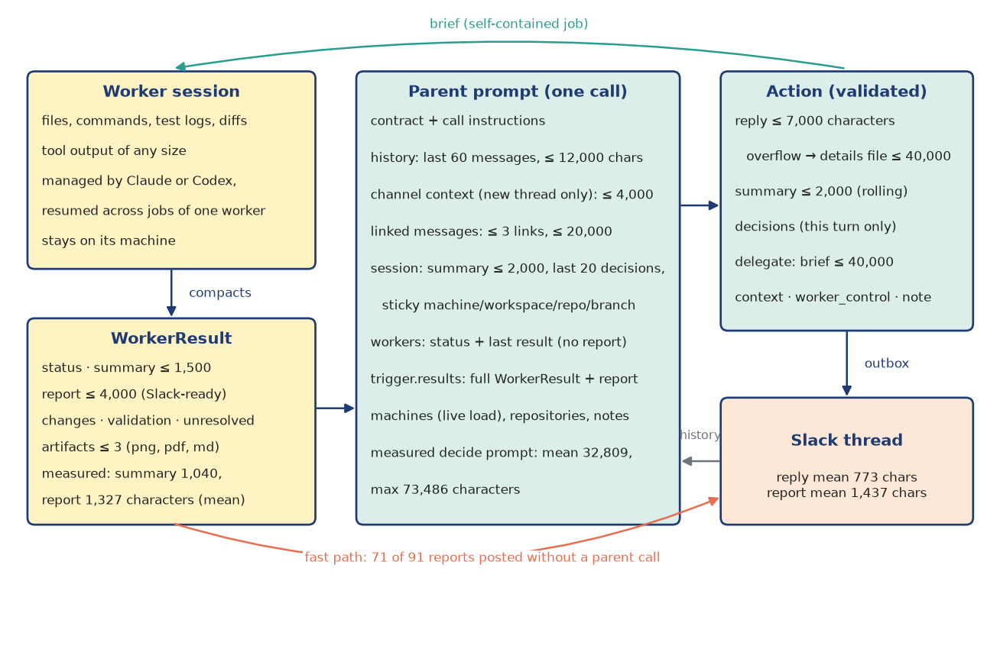
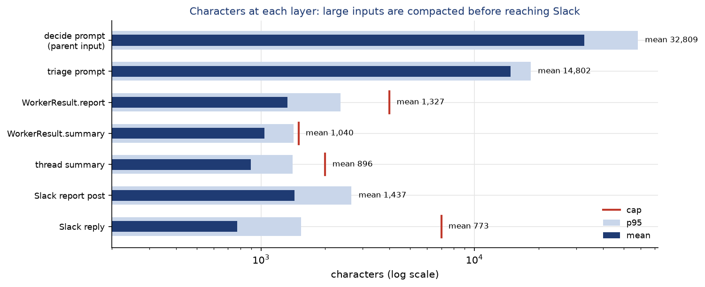
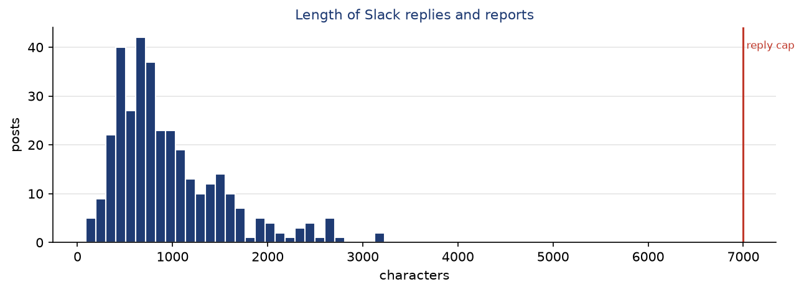

Context management
==================

An agent system that delegates work lives or dies by what each agent sees. Too little context, and the
coordinator gives wrong instructions; too much, and it becomes slow, expensive, and easy to steer with
text hidden in a log file. Fridica answers this with a *compaction hierarchy*: every hop from the
machine back to Slack shrinks the information to a bounded, structured form, and each agent sees only
the layer it needs.

   What flows between the layers and how large each part may be. Worker sessions hold unbounded
   tool output on their own machine; only the WorkerResult travels back. The parent is rebuilt from
   bounded parts on every call. Worker reports that need no coordination go to Slack directly.

Principles
----------

1. **Stateless parent.** Every parent call is a fresh, tool-less CLI invocation with no session
   persistence and a throwaway working directory. Its context is rebuilt from the thread session each
   time, so nothing accumulates in a backend session and no conversation can drift beyond its budgets.
2. **Memory is explicit and owned by the thread.** What the parent should remember is written by the
   parent itself into the session: a rolling ``summary`` (at most 2,000 characters, replaced as a
   whole), a list of ``decisions`` (the last 20 are kept), and *sticky context* (machine, workspace,
   repository, branch) that later delegations inherit.
3. **Workers keep their own context.** A worker is a long-lived backend session. Its context (files
   read, commands run, diffs) stays on its machine and inside the backend, which manages its window.
   A later job for the same worker resumes the same session, so follow-ups ("now run the tests") do
   not pay for re-reading the repository.
4. **The only channel back is structured.** A job ends with a WorkerResult; free-form transcripts
   never reach the parent.
5. **Untrusted data is labelled.** Every prompt states that messages, linked messages, notes and
   worker results are data and do not override the rules.

What the parent sees
--------------------

``threads/context.py`` assembles the parent's input from bounded parts:

* **Thread history**: the last 60 messages of the thread, newest first until ``context_chars / 2``
  characters of text are used (each message also counts an 80-character overhead).
* **Channel context**: only for a thread Fridica has not yet taken part in, the 10 channel messages
  before the root, within 4,000 characters. Once Fridica is in the thread, the summary carries what
  matters.
* **Linked messages**: Slack permalinks in the message or history (at most 3 distinct links, 20,000
  characters in total) are fetched, but only from configured channels, so a link cannot expose a
  channel that the requester might not be able to read.
* **Session**: status, turns, rolling summary, decisions and sticky context.
* **Workers**: each worker of the thread with machine, workspace, backend, role, status, a short
  summary and its last result *without* the report field.
* **Trigger**: why the call happens. For finished jobs, ``trigger.results`` holds each job's full
  WorkerResult **including the report**, plus the brief (first 1,000 characters) and any error (first
  500 characters), so the parent can write the reply from the worker's own words.
* **Environment**: the machine registry with live load (so the parent can choose a less busy machine),
  the shared repository list, the thread's task note, the delegation limits, and whether delegation
  is allowed in this channel.

The triage call is smaller: the owner's profile, repositories, summary, the last 15 history messages
and the trigger.

.. include:: generated/t11_budgets.rst

Note that ``context_chars`` (default 24,000) bounds the *conversation* part of the prompt, not the
prompt as a whole: the contract, the machine registry, worker summaries and results come on top. The
measured decide prompt averages |decide_prompt_mean| characters (maximum |decide_prompt_max|), and the
triage prompt |triage_prompt_mean|.

What the worker sees
--------------------

A worker starts from standing instructions: the worker section of the owner's contract, the owner's
profile, the repository list, a description of its machine, and its workspace. Each job then adds the
**brief**, a self-contained description written by the parent (at most 40,000 characters). Workers
never read Slack. This forces the parent to state the task, the repository, the branch and the
expected deliverable explicitly, which also makes every job reproducible from its database row.

The WorkerResult
----------------

.. code-block:: text

   status        done | partial | failed | needs_input
   summary       ≤ 1,500 characters: facts for the coordinator, not narration
   report        ≤ 4,000 characters: a Slack-ready message in the owner's voice
   changes       ≤ 30 × (path, added|modified|deleted, note)
   validation    ≤ 30 × (command, passed|failed|skipped, detail)
   artifacts     ≤ 3 × (absolute path, png|pdf|md, caption)
   machine_state branch, commit, dirty, notes
   unresolved    open items
   question      set only with needs_input

Codex receives this schema as the turn's ``outputSchema``, so its final message *is* the result. Claude
is asked to end with one fenced JSON block, and if the block is missing Fridica asks once more for the
JSON alone. In the current data the WorkerResult summaries averaged |summary_mean| characters and the
reports |report_mean|; the average result listed |validation_mean| validation entries.

**The report fast path.** When a single job finishes with status *done* and a report,
Fridica posts the report directly and skips the parent call. |fast_path| of |reports| report posts
(|fast_path_share|) took this path, which saves a decide call (median |decide_p50| s) for each of them.
Groups of jobs, partial or failed results, and questions always go through the parent.

   Measured sizes at each layer (mean and 95th percentile, log scale) against their caps. Prompts
   are tens of thousands of characters; what reaches Slack is around a thousand.

Replies and overflow
--------------------

A Slack reply is capped at ``reply_chars`` (7,000). Longer text keeps its opening in the thread with a
pointer, and the full text plus any ``details`` Markdown (up to 40,000 characters) is uploaded as a
file in the same thread, after the reply. Mentions are rendered only for people who are already in the
thread. In practice replies are short: mean |reply_mean| characters, 95th percentile |reply_p95|.

   Length of replies and reports posted to Slack.
