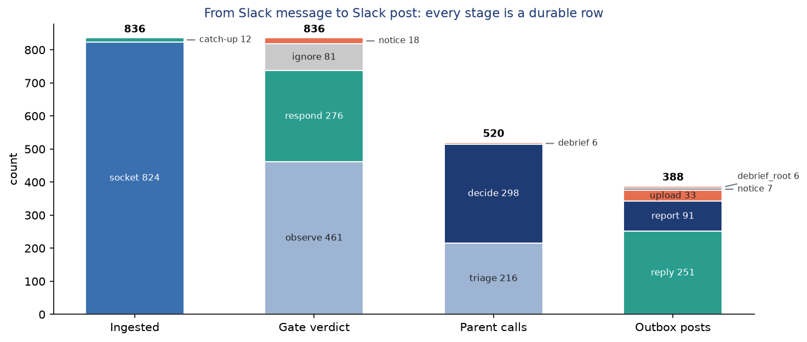
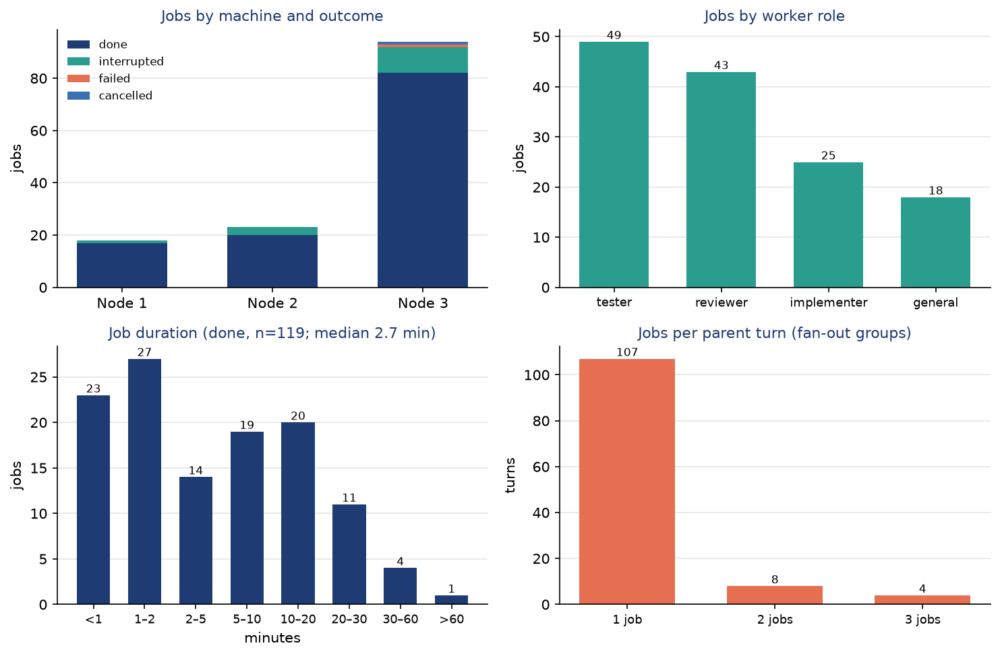
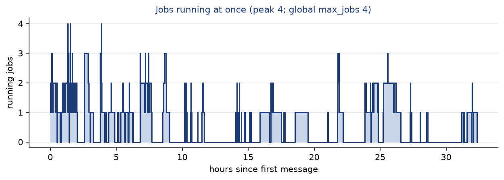
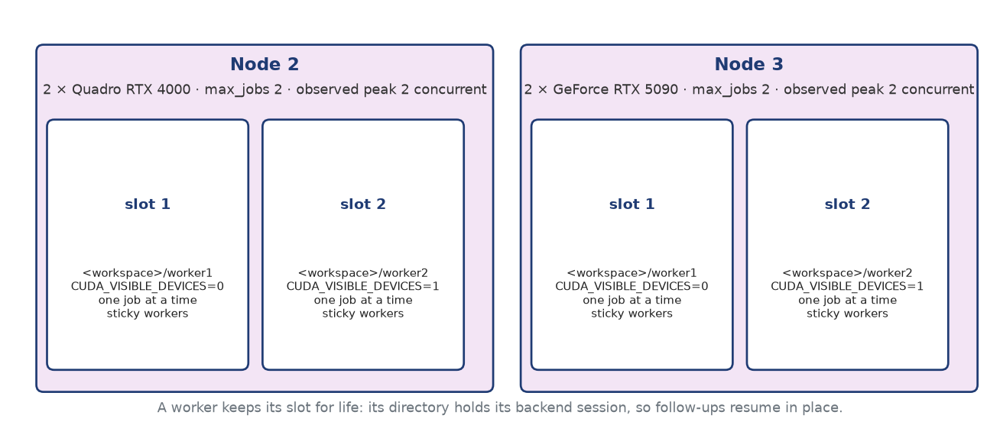

Concurrency and durability
==========================

Fridica has three sources of concurrency: many Slack threads, many workers per thread, and several
machines, each with several slots. It must also survive being stopped at any moment (Ctrl-C, a reboot,
a lost SSH connection) without posting twice, losing a request, or leaving processes running.
The design meets both needs with one mechanism: **every unit of work is a committed row before anyone
acts on it**, and every step commits all of its effects in one transaction.

From message to post
--------------------

   The lifecycle funnel in the current data: messages ingested, the gate's verdicts, the parent calls
   they caused, and the posts that resulted.

Of |ingested| ingested messages the gate observed |observe|, ignored |ignore|, answered |notice| with a
blocked-thread notice, and passed |respond| on to be answered or triaged. That gave |triage_calls|
triage calls and |decide_calls| decide calls. Most messages never reach a model: the gate is a pure
function, and the triage call is a small, fast one (median |triage_p50| s against |decide_p50| s for
decide).

Threads: parallel between, serial within
----------------------------------------

The legacy daemon serialized all threads behind one global lock. The overhaul replaces it with one
**actor per thread**. The thread manager starts an actor task for each thread that has pending inbox
items; the actor drains its inbox strictly in order and exits when it is empty. Threads therefore
proceed in parallel. A long decide call in one thread does not delay another, but two events in the
same thread can never race. Parent calls from all threads share a semaphore of ``parent_concurrency``
slots, so a burst of threads cannot start an unbounded number of CLI processes.

An inbox item's effects commit atomically: the session update, the outbox posts, new workers and jobs,
the task note, the verdict on the message, follow-up inbox items, the parent-call records, and the
item's own completion. A failure before the commit leaves the item pending. It is retried up to three
times (``attempts`` is persisted, so a poisoned item cannot loop across restarts), then dropped with an
audit record. Optimistic versioning of the session row (``StaleSession``) prevents an owner action and
an actor from overwriting each other.

The doorbell bus
~~~~~~~~~~~~~~~~

Components wake each other through in-process *doorbells*: the thread actor rings the outbox after
committing posts, and the supervisor after committing jobs. Doorbells carry no data. Each component
also polls periodically (every 5 s for outbox and jobs), so a lost ring costs latency, never work.

Workers, jobs and fan-out
-------------------------

A decision may delegate up to ``max_delegations_per_turn`` jobs at once, to existing workers of the
thread or to new ones on any machine. The jobs of one decision form a **join group**. When a job
finishes, its thread receives a ``worker_result`` item, but only the last job of a group to finish
triggers the parent, which then sees all results together. This is how a thread runs an implementer on
one machine and a tester on another and gets one combined reply.

   Jobs by machine and outcome, by worker role, their duration, and the size of the join groups
   (|fan_out| decisions started more than one job).

The **supervisor** schedules queued jobs under four limits: one job per worker; ``max_jobs`` per
machine (its slots); the global ``limits.max_jobs``; and ``max_workers`` live processes per machine
(idle processes are evicted first). A thread may hold at most ``max_workers_per_thread`` live
persistent workers. *Ephemeral* workers retire after one job and do not count against that limit;
|ephemeral| of the |workers| workers so far were ephemeral, which is why one thread could use up to
|max_workers_thread| workers over its lifetime.

.. include:: generated/t6_jobs.rst

.. include:: generated/t6b_workers.rst

Jobs took a median of |job_p50_min| min (95th percentile |job_p95_min| min, longest |job_max_min| min).
Most started immediately: the median queue wait was |queue_p50_s| s. A few waited for a busy slot, so
the mean wait was |queue_mean_s| s and the 95th percentile |queue_p95_s| s.

   Jobs running at the same time, computed from the start and finish times of all jobs. The peak was
   |peak| concurrent jobs.

Slots, subfolders and GPU split
-------------------------------

A machine with ``max_jobs = 2`` has two *slots*. Each worker gets a sticky slot on its machine the
first time it runs. With ``subfolders`` on (the default), slot *k* works in ``<workspace>/worker<k>``,
so two jobs in the same workspace never edit the same checkout. Slot *k* also sees only its share of
the machine's GPUs (``CUDA_VISIBLE_DEVICES``): with two GPUs and two slots, each slot gets one GPU;
with fewer GPUs than slots they are shared round robin. A worker whose slot is busy waits rather than
moving, because moving would change its directory and invalidate its session's view of the files.

   Slots on the configured GPU machines: each slot has its own subfolder and GPU.

Durability and recovery
-----------------------

**The outbox.** Every post (reply, report, notice, debrief, upload) is committed to the outbox with an
idempotency key derived from the inbox item that produced it. A second attempt to enqueue the same key
is refused. The dispatcher sends due posts in per-thread order, respecting ``after`` dependencies (an
upload goes after its reply, a debrief after the final reply):

* a rate limit reschedules the post;
* a rejection fails it, visibly in the dashboard;
* an unknown outcome (5xx, dropped connection) marks it *ambiguous*, which is never resent
  automatically because it may already be in Slack.

In the current data |posts| posts were enqueued and |posts_unsent| remain unsent.

**Recovery at start.** ``Store.recover`` runs before Slack is connected and replays nothing ambiguous:

* inbox items that were being processed are finished if their parent call was recorded (the call and
  its effects commit together), and retried otherwise;
* posts that were being sent become *ambiguous*;
* running jobs become *interrupted*, their workers *lost*, and each thread receives a
  ``worker_interrupted`` item so it can tell the requester (with ``auto_resume`` it reruns them once,
  continuing the backend session);
* pending approvals expire.

Then the catch-up rereads the last hour of each channel.

**Processes die with their owner.** Local workers run in their own process group and are terminated
as a group. Remote workers run behind a small watchdog. The SSH channel holds a FIFO open; when the
channel closes, the watchdog sends ``SIGTERM`` to the agent's ``setsid`` process group. Stopping the
daemon, or losing the network, therefore stops remote agents too, instead of leaving them running on
the GPU machine.
