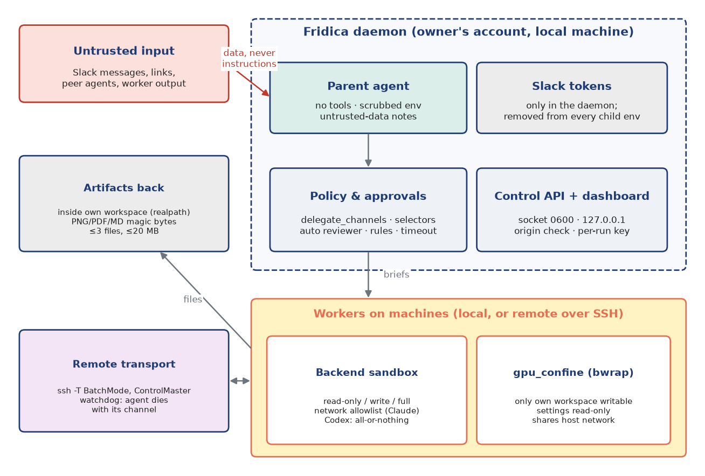

Security
========

Fridica holds two powerful capabilities: the owner's Slack user token (anything it posts appears to
come from the owner) and the ability to run agents with shell access on the owner's machines. Anyone
who can write in a watched channel, and any file or web page a worker reads, can try to influence
it. The security design starts from one assumption: **all text is untrusted**. Authority comes only from
configuration and from the owner's explicit actions.

   Trust zones. Untrusted text reaches the parent only as data; the parent has no tools; the Slack
   tokens never leave the daemon; workers run on machines under per-workspace policy; only validated
   files come back.

Trust boundaries
----------------

**Slack → daemon.** Messages are normalized and size-limited at ingress (40,000 characters). Only
configured channels in the bound workspace are processed. The prompts label messages, linked messages,
notes and worker results as untrusted data that cannot override the rules. Links are followed only
into configured channels, at most three per message.

**Daemon → parent.** The parent is a tool-less, stateless structured-output call. It cannot read
files, run commands or reach the network through tools. The worst a manipulated parent can do is
return an action, and actions are validated: machines and workspaces must exist in the registry,
workers must belong to the thread, the number of jobs and workers is capped, and delegation is refused
in channels outside ``delegate_channels``. Replies are posted only into the thread being processed.

**Daemon → workers.** Every child process (parent calls, local workers, SSH) gets a scrubbed environment:
the configured token variables, any variable whose name contains ``SLACK``, and any value that looks like
a Slack token (``xoxp-``, ``xoxb-``, ``xapp-``, ``xoxe-``) are removed. A worker running arbitrary
commands therefore cannot post as the owner. Workers also never receive Slack text directly, only the
parent's brief.

**Workers → machines.** A worker's powers come from the policy of its workspace, not from the prompt:

.. list-table:: Policy modes and how each backend enforces them
   :header-rows: 1
   :widths: 16 42 42

   * - Mode
     - Claude worker
     - Codex worker
   * - read-only
     - tools limited to Read, Glob, Grep
     - ``read-only`` sandbox
   * - write (default)
     - Claude's sandbox on (``failIfUnavailable``); Bash auto-allowed inside it; network limited to
       ``policy.network`` domains
     - ``workspace-write`` sandbox; network on only if ``policy.network`` is non-empty
   * - full
     - sandbox off
     - ``danger-full-access``

For every Claude worker, hooks, plugins, connectors, auto-memory, slash commands and MCP servers are
disabled (``--setting-sources ""``, ``--strict-mcp-config`` with an empty server list). Setting sources
are ignored, so a repository cannot inject its own settings into a worker.

**GPU confinement.** Both backends sandbox commands with bubblewrap, whose minimal ``/dev`` hides GPU
devices. For write-mode workspaces on machines that declare GPUs, ``gpu_confine`` is therefore on by
default: the backend's sandbox is off and Fridica wraps the whole agent in its own bubblewrap
confinement instead. The filesystem is read-only except the worker's workspace, a private ``/tmp`` and
the backends' state directories; ``/dev`` is visible; the backends' settings files and hooks directory
are bound read-only so a job cannot plant hooks that later run unconfined. The residual risks are
documented in the code: the network is shared with the host (the CLI must reach its model API), and
``~/.claude.json`` stays writable. The next section explains the kernel mechanisms and measures what
each sandbox allows, including side channels that ``gpu_confine`` leaves open.

**Approvals.** What a worker may do beyond its sandbox is decided per request:

* ``auto`` (the default): the backend's own reviewer decides (Claude's ``auto`` permission mode, Codex's
  ``auto_review``) and escalates to the owner what it will not approve;
* ``on-request``: ask the owner whenever the worker needs more than its sandbox;
* ``untrusted``: ask for edits and most commands too;
* ``never``: refuse anything outside the policy.

Before asking the owner, rules may decide: ``auto_deny`` and ``auto_approve`` command prefixes. A prefix
rule never approves a command containing shell control characters, so ``pytest`` cannot approve
``pytest; rm -rf ~``. A request waits in the database and the dashboard until the owner decides
(once, for the session, or deny). After ``approval_timeout`` it is denied and the worker continues
without it. Every automatic decision is audited, and approval details (which may contain secrets) stay
in the database, never in the log. In the current period |approvals| approval requests reached the owner:
under the ``auto`` default, the backends' reviewers resolved every request themselves.

**Machines → daemon.** Remote access goes through ``ssh -T`` with ``BatchMode`` (no password prompts)
over an owner-only ControlMaster directory; nothing listens on a port. Files returned as artifacts are
read only if their real path lies inside the worker's workspace, their suffix and magic bytes match the
declared kind (PNG, PDF, UTF-8 Markdown), and they fit 20 MB, at most three per result.

**Owner → daemon.** The control API is HTTP on a Unix socket created with mode 0600 under an owner-only
directory, and the database file is 0600. The dashboard listens on 127.0.0.1 only. It rejects requests
whose Host is not local or whose Origin is foreign, requires the per-run key printed in the terminal
(compared in constant time), proxies only an allowlist of endpoints, and sets a strict
Content-Security-Policy. It holds no state of its own.

Controls matrix
---------------

.. list-table:: Threats, mechanisms and where they are implemented
   :header-rows: 1
   :widths: 30 44 26

   * - Threat
     - Mechanism
     - Code
   * - Prompt injection in Slack text or files steers tools
     - Parent has no tools; actions validated against registry and thread; untrusted-data notes in every prompt
     - ``parent/llm.py``, ``parent/actions.py``, ``parent/prompts.py``
   * - Worker exfiltrates the Slack token
     - Scrubbed environment for every child process
     - ``exec/process.py``
   * - Anyone in a channel starts jobs on the owner's machines
     - ``delegate_channels``; triage and gate before any decision; per-thread worker caps
     - ``config/schema.py``, ``threads/policy.py``
   * - Link to a private channel leaks its content
     - Only links into configured channels are followed
     - ``slack/links.py``
   * - Worker escapes its workspace
     - Backend sandbox per policy mode; bubblewrap confinement on GPU machines
     - ``workers/claude.py``, ``workers/codex.py``, ``exec/sandbox.py``
   * - Job plants hooks or settings for later sessions
     - Settings sources ignored; settings files bound read-only under confinement; hooks disabled
     - ``workers/claude.py``, ``exec/sandbox.py``
   * - Dangerous command slips through a prefix rule
     - Shell control characters disable auto-approval; auto-deny checked first
     - ``approvals/rules.py``
   * - Forgotten approval blocks a slot forever
     - Timeout to deny; expiry on restart
     - ``approvals/broker.py``, ``store/__init__.py``
   * - Worker returns arbitrary files for upload
     - Realpath inside workspace, magic bytes, size and count limits
     - ``workers/artifacts.py``
   * - Local web page drives the dashboard
     - 127.0.0.1, Host and Origin checks, per-run key, allowlist, CSP
     - ``dashboard/server.py``
   * - Other local users read state or control the daemon
     - 0600 socket and database, 0700 directories
     - ``control/api.py``, ``store/db.py``
   * - Two agents loop, spamming a channel
     - Shared turn metadata, ignore finished peers, wait-streak and no-progress pauses, cooldown
     - ``threads/policy.py``
   * - Orphaned remote agents keep running
     - SSH watchdog kills the process group when the channel closes
     - ``exec/ssh.py``
