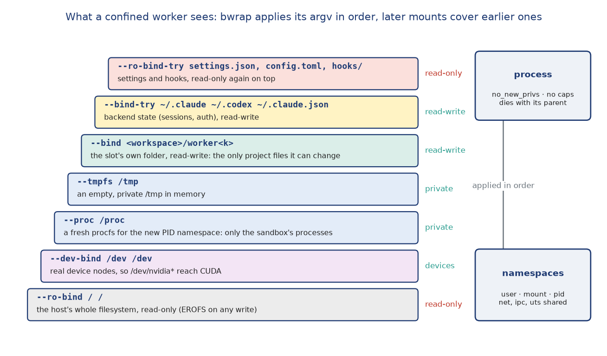
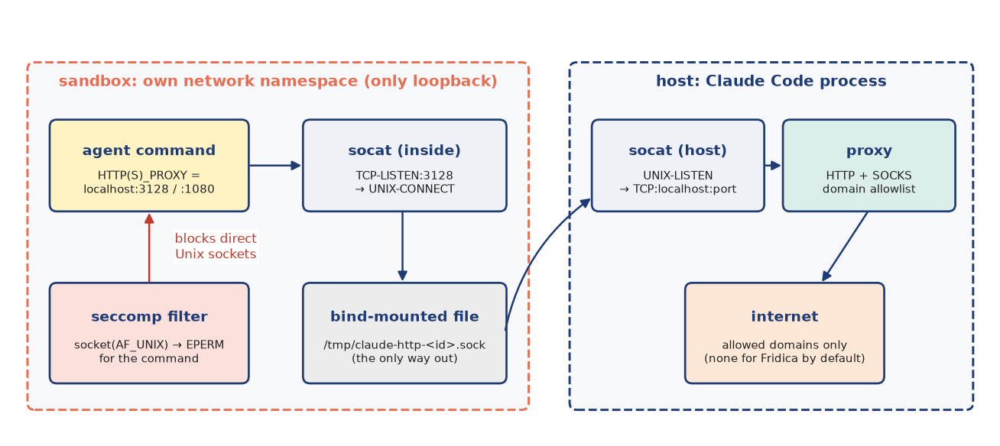
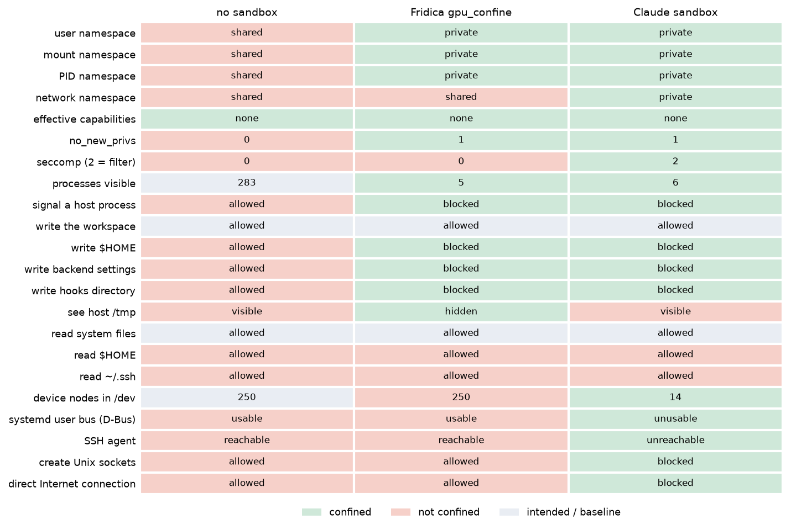

Sandboxing: how the kernel confines a worker
=============================================

The security section states *policies*: a worker in a write-mode workspace may change its workspace and
nothing else. This section explains the *mechanism*: how, on Linux, an agent process that runs
arbitrary shell commands as the owner is kept inside its designated folder. Three sandboxes are
involved. Claude Code's sandbox combines bubblewrap, socat and seccomp. Codex's sandbox combines
bubblewrap, seccomp and ``no_new_privs``. Fridica's own ``gpu_confine`` uses bubblewrap alone, for GPU
machines. All three are assembled from the same few kernel features, and the section ends with a
measurement of what each one actually allows.

One point up front, because the measurements confirm it: all three sandboxes confine what a worker can
**change**, **signal** and (except ``gpu_confine``) **reach over the network**. None of them, as
Fridica configures them today, hides what a worker can **read**. The rest of the filesystem is mounted
read-only, not removed.

Kernel building blocks
----------------------

**Namespaces.** A namespace wraps a global kernel resource so that processes inside it see their own
instance. A process enters new namespaces with ``clone(2)`` or ``unshare(2)``, and each namespace has an
identity visible as ``/proc/<pid>/ns/<type>``. The probe below compares these identities inside and
outside the sandbox.

.. list-table:: Namespaces used by the sandboxes
   :header-rows: 1
   :widths: 18 18 64

   * - Namespace
     - Flag
     - What it isolates here
   * - user
     - ``CLONE_NEWUSER``
     - UID/GID mapping and capabilities. An unprivileged user may create one and holds capabilities
       *inside* it, which is what lets bubblewrap build mounts without root. The mapping keeps the
       owner's UID, so the kernel's real permission checks still apply: the sandbox can never exceed
       the owner's rights, only subtract from them.
   * - mount
     - ``CLONE_NEWNS``
     - A private copy of the mount table. Bind mounts and read-only remounts made inside are invisible
       outside, and mount propagation is set to private so nothing leaks back.
   * - PID
     - ``CLONE_NEWPID``
     - Its own process-ID space. The first process is PID 1, host processes do not exist from inside,
       and so they can be neither listed nor signalled.
   * - network
     - ``CLONE_NEWNET``
     - Its own interfaces and routing table; a new namespace has only a loopback device. It also scopes
       *abstract* Unix sockets, which have no filesystem path and are otherwise shared host-wide.
   * - IPC, UTS
     - ``CLONE_NEWIPC``, ``CLONE_NEWUTS``
     - System V IPC and POSIX message queues; hostname. None of the three sandboxes unshares these here.

**Bind mounts and read-only remounts.** A bind mount makes an existing directory or file appear at
another path. Remounting a bind with ``MS_RDONLY`` makes every write under it fail with ``EROFS``
("read-only file system"), whatever the file permissions say. A later mount on the same path covers
the earlier one. Sandboxes exploit this layering: first mount everything read-only, then mount the
few writable places on top.

**pivot_root.** bubblewrap assembles the new tree under a fresh ``tmpfs`` and then makes it the root with
``pivot_root(2)``, detaching the old root. Afterwards the process can reach only what was mounted
into the new tree.

**no_new_privs, capabilities and seccomp.** ``prctl(PR_SET_NO_NEW_PRIVS)`` guarantees that no later
``execve`` can gain privileges: set-user-ID bits and file capabilities are ignored. It is also the
precondition for an unprivileged process to install a *seccomp-BPF* filter, a small program the kernel
runs on every system call. The filter can inspect a call's number and its integer arguments, for
example the address family passed to ``socket(2)``, but not the memory that pointer arguments point to.
A filter can therefore forbid Unix sockets as a whole, but it cannot forbid one socket *path*. After
the sandbox is set up the process keeps no effective capabilities.

**Process lifetime.** ``PR_SET_PDEATHSIG`` (bubblewrap's ``--die-with-parent``) kills the sandbox when its
parent dies, which together with Fridica's SSH watchdog means no sandboxed agent outlives its worker.
``setsid`` (bubblewrap's ``--new-session``) detaches it from the controlling terminal, so it cannot push
keystrokes into the owner's terminal with the ``TIOCSTI`` ioctl.

**AppArmor and unprivileged user namespaces.** Since Ubuntu 24.04 the kernel setting
``kernel.apparmor_restrict_unprivileged_userns = 1`` lets only programs with an AppArmor profile that
permits it create user namespaces. Without a profile for ``bwrap`` every sandboxed command fails. This
is why the README installs a profile and ``fridica doctor`` runs a real ``bwrap --unshare-user
--unshare-net … /bin/true`` probe on every machine.

bubblewrap
----------

bubblewrap (``bwrap``) is a small program that turns these primitives into a command line. It clones a
child into the requested namespaces, writes the UID/GID maps, builds a tmpfs root and applies its
mount arguments **in argv order**, pivots into the new root, drops capabilities, sets
``no_new_privs``, and executes the command. Every sandbox in this section is, at its core, a bwrap argv.

Fridica's confinement: ``gpu_confine``
--------------------------------------

The backends' own sandboxes give the command a minimal ``/dev`` (the probe counts |sb_claude_dev| device
nodes inside Claude's, against |sb_host_dev| on the host), so ``/dev/nvidia*`` is missing and CUDA fails.
For write-mode workspaces on machines that declare GPUs, Fridica therefore turns the backend's
sandbox off and runs the whole agent inside its own bwrap. The argv comes from ``exec/sandbox.py``:

.. code-block:: text

   bwrap --die-with-parent --unshare-user --unshare-pid
         --ro-bind / /                    # everything read-only
         --dev-bind /dev /dev             # real devices: GPUs visible
         --proc /proc                     # procfs of the new PID namespace
         --tmpfs /tmp                     # private, empty /tmp
         --bind <workspace>/worker<k> <workspace>/worker<k>    # the slot's folder, writable
         --bind-try ~/.codex ~/.codex  --bind-try ~/.claude ~/.claude
         --bind-try ~/.claude.json ~/.claude.json              # backend state, writable
         --ro-bind-try ~/.codex/config.toml …  --ro-bind-try ~/.claude/settings.json …
         --ro-bind-try ~/.claude/settings.local.json …  --ro-bind-try ~/.claude/hooks …
         -- claude -p …                   # or codex app-server

   The mount layers of ``gpu_confine``. Each line covers the ones below it, so the settings files are
   read-only again inside the writable backend state directory.

Three details matter:

* **The writable folder is the slot's subfolder.** With ``subfolders`` on, the bound path is
  ``<workspace>/worker<k>``, so two jobs on the same machine cannot write each other's checkouts.
* **Settings are re-bound read-only.** The state directories must be writable, because sessions and
  authentication live there. The files that configure future runs (settings, hooks, ``config.toml``)
  are mounted read-only on top, so a job cannot plant a hook that later runs unconfined in the
  owner's own sessions. Missing files are created empty first, because bwrap can bind only a path that
  exists.
* **On a remote machine** the same argv runs through ``ssh -T``, with ``$HOME`` left for the remote shell
  to expand, inside the watchdog described in the concurrency section.

What ``gpu_confine`` does *not* do is equally important. It creates no network namespace (the CLI must
reach its model API), installs no seccomp filter, and shares IPC.

Claude Code's sandbox
---------------------

For Claude workers outside ``gpu_confine``, Fridica enables Claude's sandbox with
``failIfUnavailable`` (Claude refuses to start without it), auto-allows Bash only inside it, forbids
unsandboxed retries when approvals are ``never``, and passes ``policy.network`` as the domain allowlist
(empty by default). Claude then wraps every Bash command it runs:

* **Filesystem.** ``--ro-bind / /``, then writable binds for the working directory and Claude's
  temporary space. Paths configured as deny-read are masked. Fridica configures none, and Claude's
  optional ``blockReadsOutsideWorkingDirectories`` is not set.
* **Process.** ``--new-session --die-with-parent`` and a PID namespace.
* **Network.** ``--unshare-net`` gives the command an empty network namespace. The only way out is a
  pair of Unix sockets, bridged by **socat**, which is why Claude requires socat on Linux. On the host,
  Claude runs an HTTP and SOCKS proxy on a localhost port that enforces the domain allowlist, plus
  ``socat UNIX-LISTEN:/tmp/claude-http-<id>.sock … TCP:localhost:<port>``. The socket file is
  bind-mounted into the sandbox. Inside, a second socat listens on ``TCP:3128`` (HTTP) and ``TCP:1080``
  (SOCKS) of the sandbox's own loopback and forwards to that socket, and the command gets
  ``HTTP_PROXY``/``HTTPS_PROXY`` pointing at it. The processes captured during the probe show exactly
  this: host ``socat UNIX-LISTEN:… TCP:localhost:<port>`` and in-sandbox
  ``socat TCP-LISTEN:3128 UNIX-CONNECT:…``.
* **seccomp.** A helper sets ``no_new_privs`` and installs a filter that makes ``socket(AF_UNIX, …)``
  fail for the command itself. The bridges are started before the filter, so they keep working. The
  command cannot open the D-Bus session bus, an SSH agent, the Docker socket or any other Unix socket
  that the read-only filesystem still shows. Because seccomp cannot filter by path, Claude blocks the
  whole address family.

   The network path of a sandboxed Claude command: an empty network namespace whose only exit is a
   bind-mounted Unix socket, bridged by socat to Claude's allowlisting proxy on the host.

Codex's sandbox
---------------

Codex's Linux helper follows the same pattern with a different division of labour. In its own words,
it runs "bubblewrap first … and only tighten[s] with seccomp after the filesystem view is established".
bwrap (the system one when present, otherwise a bundled copy) mounts the filesystem read-only except the
workspace's writable roots for ``workspace-write``, or nothing writable for ``read-only``. Inside the
sandbox the helper then sets ``no_new_privs`` and installs a seccomp filter before executing the
command, and with network access off that filter refuses network sockets. Older releases used Landlock
(a Linux security module for unprivileged file-access rules) instead of bubblewrap, which is still
available as an opt-in. Fridica has no Codex workers configured at present, so Codex is described from
its implementation rather than measured.

Measured: what a worker can see and do
--------------------------------------

The build runs ``docs/scripts/sandbox_probe.sh`` three times:

* on the host without a sandbox, as the baseline;
* inside Fridica's confinement, with the argv built by the same ``exec/sandbox.py`` code;
* inside Claude's sandbox, with the settings Fridica gives its Claude workers. This run needs a model
  call, so it is repeated only with ``--probe-claude``.

The probe writes only inside its temporary workspace and ``/tmp``. It never reads file contents, and it
tests reachability of the session bus and the SSH agent with read-only requests.

   What a process can see and do in each setting. Green cells are confined, red cells are not, and
   grey cells are the intended behaviour or the baseline. The confined columns see |sb_fridica_visible|
   and |sb_claude_visible| processes against |sb_host_visible| on the host.

.. include:: generated/t14_sandbox_env.rst

What the measurements show:

* **Writes are confined in both sandboxes.** The workspace is writable. ``$HOME``, the backend
  settings and the hooks directory are not, and fail with ``EROFS``. No capabilities remain,
  ``no_new_privs`` is set, and host processes cannot be seen or signalled.
* **Reads are not confined in either.** The whole filesystem, including ``$HOME`` and ``~/.ssh``, is
  readable. The sandboxes stop a worker from *changing* things outside its folder, not from *seeing*
  them. Everything a worker reads can end up in its WorkerResult and from there in Slack.
* **Claude's sandbox also closes the side channels.** Its network namespace blocks direct Internet
  connections, and its seccomp filter blocks Unix sockets, so the systemd user bus and the SSH agent
  are unusable even though their socket files are visible.
* **Fridica's confinement leaves those channels open.** Beyond the risks documented in the code (the shared
  network, a writable ``~/.claude.json``), the probe found three more:

  - The **systemd user manager answers over the D-Bus session bus**. It can start transient units
    outside the sandbox, so this is a path out of the confinement.
  - The owner's **SSH agent is reachable**, so a job could authenticate to other machines as the owner.
  - **Abstract Unix sockets and loopback services** of the host are reachable, because the network
    namespace is shared.

Hardening
---------

These changes would close the gaps. None of them is implemented yet.

.. list-table:: Hardening options
   :header-rows: 1
   :widths: 34 40 26

   * - Gap
     - Option
     - Cost
   * - Session bus, SSH agent (``gpu_confine``)
     - ``--tmpfs /run/user/<uid>``; drop ``DBUS_SESSION_BUS_ADDRESS`` and ``SSH_AUTH_SOCK`` from the worker
       environment; ``--unshare-ipc``
     - None for workers that need neither
   * - Unix sockets in general (``gpu_confine``)
     - A seccomp filter refusing ``socket(AF_UNIX)`` after setup, as Claude and Codex do
     - A small helper; the CLI's own sockets must be opened first
   * - Shared network (``gpu_confine``)
     - ``--unshare-net`` plus a socat bridge to an allowlisting proxy, as in Claude's design
     - The model API must be allowlisted
   * - Reads outside the workspace (all)
     - Claude: ``blockReadsOutsideWorkingDirectories`` or deny-read for ``~/.ssh`` and similar;
       ``gpu_confine``: ``--tmpfs $HOME`` and re-bind only the workspace and backend state
     - Toolchains installed under ``$HOME`` must be re-bound read-only
