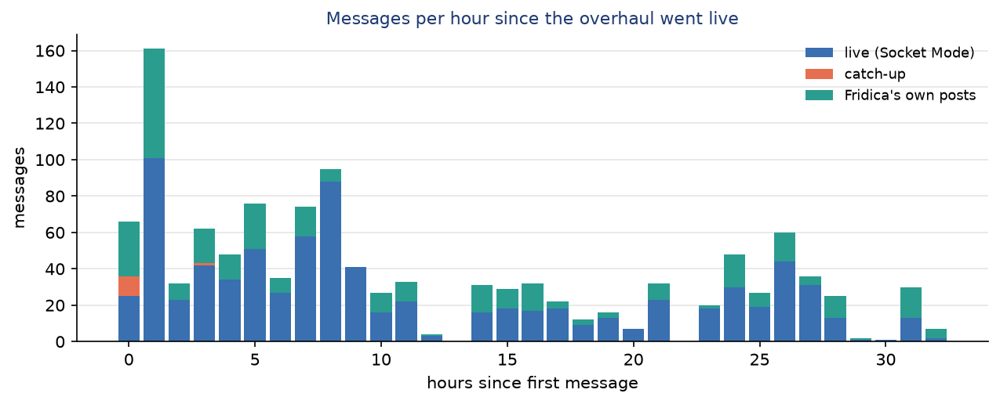
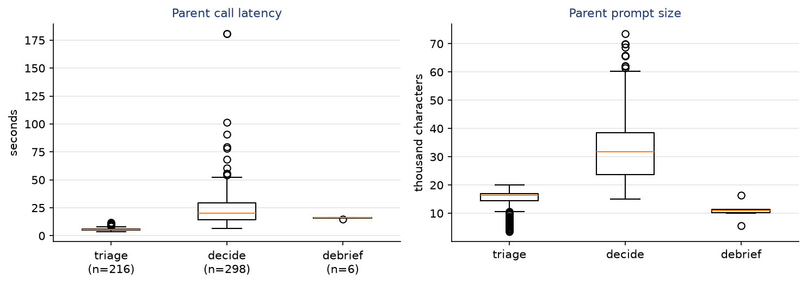

Operations: observed behavior
=============================

This section reports how the current design behaved in its first |new_hours| hours of real use, from
|new_start| to |new_end|. All numbers come from the state database snapshot taken at |snapshot|.

Activity
--------

   Stored messages per hour by source. The catch-up recovered messages mainly in the first hour, while
   the daemon was being restarted during deployment.

Fridica took part in |joined| of the |threads| threads it saw. It observed the other |never_joined|
without answering, because nobody addressed the owner and the triage call judged them not worth an
unsolicited reply. The busiest thread lasted |max_turns| turns. Currently |paused_threads| threads are
paused (by the stall rules or by the owner) and |blocked_threads| are blocked: their last reply said Fridica could not
proceed without the owner. The owner resumed threads from the dashboard; each resume is an audited control action.
Threads kept a mean of |decisions_mean| recorded decisions, and |note_threads| threads kept a task note,
with |note_revisions| revisions in total.

Parent reliability and latency
------------------------------

.. include:: generated/t5_parent.rst

   Latency and prompt size of parent calls by type.

The parent made |parent_calls| calls with |parent_errors| errors. An error in a decide call does not
lose the message: the actor posts a short "unavailable" reply, or, if the process failed before its
commit, retries the item. Repair rounds are rare (|repair_calls| in this period): the strict schema,
and machine and workspace names that the parent copies from the machines field, keep most actions
valid on the first attempt. Triage calls are about four times faster than decide calls and carry half the prompt,
which is why the gate sends only ambiguous messages to triage and addressed ones straight to decide.

Jobs and results
----------------

Workers ran |jobs| jobs: |jobs_done| finished, |jobs_interrupted| were interrupted (by daemon restarts
during development, or by the owner), and |jobs_failed| failed. Jobs that ran to the end returned a WorkerResult:

.. include:: generated/t7_results.rst

A *partial* or *needs_input* result is not a failure of the system. It is the worker saying what
it could not finish, or asking a question, and the parent relays it to the thread. On average a result
listed |changes_mean| changed files and |validation_mean| validation commands.

Outbox and artifacts
--------------------

Fridica enqueued |posts| posts: |replies| replies, |reports| reports, |uploads| uploads, plus notices
and debriefs. All were sent and none is failed or ambiguous (|posts_unsent| unsent). Workers returned
|artifacts| artifacts, all Markdown files (mean |artifact_kb| kB), every one of which passed validation.

Operational lessons
-------------------

The data and the incident history since the overhaul shaped several follow-up changes:

* **Remote processes outliving the daemon.** Stopping Fridica with Ctrl-C left jobs running on two
  GPU machines. The SSH watchdog now ties every remote agent to its channel.
* **GPU visibility.** The backends' own sandboxes hide ``/dev/nvidia*``. ``gpu_confine`` became
  automatic for write-mode workspaces on GPU machines.
* **Two jobs per machine.** With ``max_jobs = 2`` two workers can edit the same workspace at the same
  time. Per-slot subfolders (on by default) and a GPU split per slot give each its own checkout and
  device.
* **Missed messages.** Socket Mode occasionally drops events even while connected. The periodic
  catch-up recovered |catchup_msgs| messages in this period.
* **Owner direction without a Slack message.** The dashboard's *instruct* action sends a private
  ``owner_instruction`` to a thread, and the *attention* view lists threads that need the owner.
