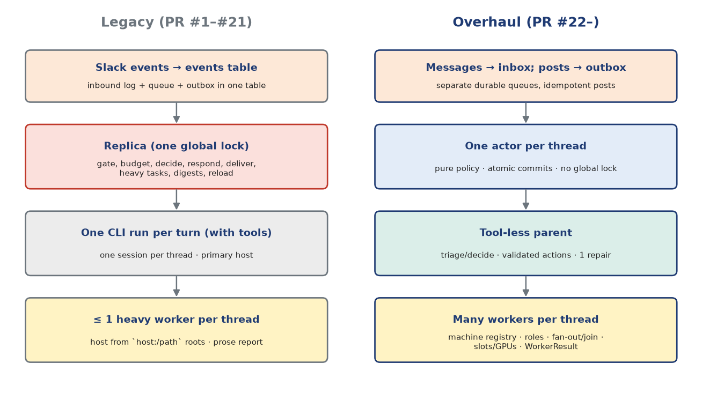
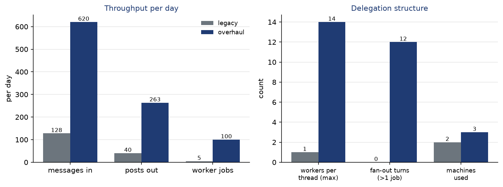
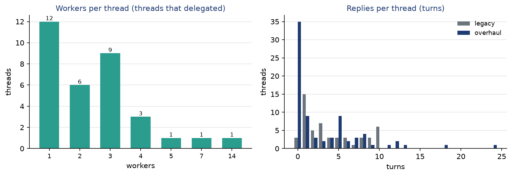

Appendix: the overhaul compared with the previous design
=========================================================

Fridica's first design grew over PR #1–#21 (|old_start| to |old_end|). It worked, and it taught
the lessons the overhaul (PR #22) is built on. This appendix compares the two architectures and then
the two databases. Throughout, the legacy design is described as it was at PR #21, just before the
overhaul (|old_lines| lines of Python, against |lines| now).

   The two architectures side by side.

The previous design
-------------------

The legacy daemon was organized around one class, ``Replica``, described in its own docstring as "the
only place that knows the rules of engagement": gate, turn budget, decide, respond, deliver and follow
up for every message. Its main properties:

* **One global lock.** A single ``asyncio.Lock`` in ``Replica`` serialized message processing across
  all threads. A slow model call in one thread delayed every other thread.
* **One CLI run per turn, with tools.** Each reply was a run of the Claude or Codex CLI with the
  backend's tools and sandbox, continuing one persisted backend session per thread on a *primary host*.
  The agent that talked to Slack was also the agent that read files.
* **At most one heavy worker per thread.** When the reply agent escalated, the thread got one
  long-lived worker process, placed by ``host:/path`` workspace roots. It returned a prose report
  (with ``ATTACH:`` lines for files). Its approval requests were declined, because there was no approval
  interface.
* **An events table as log, queue and outbox.** Inbound events and Fridica's own outgoing posts
  (recorded to recognize their echoes) shared one ``events`` table; only replies were durable, and
  notices, wrap-ups and debriefs were best effort.
* **Schema spread across modules.** ``CREATE TABLE`` statements lived in several modules, and the
  per-thread ``tasks`` row had |old_task_columns| columns covering session, turns, loop state, heavy
  task state and notes.
* **A turn budget.** Every thread had a fixed maximum number of turns (default 6), after which
  Fridica wrote a wrap-up and could continue only by an explicit continuation.
* **A file-access planner.** Local file operations requested by the reply agent were planned and
  executed by Fridica itself, with its own approval rules.

Structural comparison
---------------------

.. include:: generated/t9_comparison.rst

Data comparison
---------------

The two eras differ in length, in usage and in who was using the system. The legacy database covers
|old_days| days of mostly single-user development; the current one covers |new_hours| hours with more
people in the channel and a working multi-machine setup. The numbers below are normalized per day
where that makes sense. They show what each design *did*, not a controlled experiment.

   Throughput per day (left) and the structure of delegated work (right) in the two designs.

* **Traffic.** The legacy database holds |old_events| events: |old_inbound| inbound messages and
  |old_posts| records of its own posts. The current database holds |messages| messages, of which
  |ingested| were ingested from Slack, and |posts| posts.
* **Delegated work.** The legacy design ran |old_heavy| heavy jobs in |old_days| days
  (|jobs_per_day_old| per day), |old_heavy_main| of them on a single host. The current design ran |jobs|
  jobs in |new_hours| hours (|jobs_per_day_new| per day) across |machines| machines, with up to
  |peak| running at once. Legacy threads could use at most one worker; now one thread used
  |max_workers_thread|, and |fan_out| decisions started parallel jobs.
* **Thread length.** No legacy thread exceeded |old_max_turns| turns, and |old_at_cap| of them ended
  exactly there. Without a turn limit, the longest current thread ran |max_turns| turns, and stalls
  were caught by the wait-streak and no-progress rules instead (|paused_threads| threads paused).
* **Continuity.** The legacy database persisted |old_sessions| backend sessions for its |old_tasks|
  tasks and needed |old_continuations| wrap-up continuations. In the current design each worker has
  its own resumable session, and the parent needs none.
* **Replies.** Mean reply length fell from |old_reply_mean| to |reply_mean| characters. The details
  now go into worker reports, uploaded files and the task note rather than into the thread.

   Workers per thread in the current design (left) and turns per thread in both designs (right):
   the legacy distribution stops at |old_max_turns| turns.

Benefits of the current design
------------------------------

**Scalability.** Replacing the global lock with per-thread actors turns *N* busy threads from a queue
into parallel work, bounded only by ``parent_concurrency`` and machine slots. Separating the tool-less
parent from the workers lets one thread fan out to several machines: |fan_out| decisions started
parallel jobs, and the peak of |peak| concurrent jobs was impossible before.

**Context isolation.** The legacy reply agent accumulated tool output in the same session that wrote
Slack replies. Now the parent is rebuilt from bounded parts on every call, workers keep their own
context on their own machines, and only the WorkerResult (mean summary |summary_mean| characters)
crosses back. |fast_path_share| of reports needed no parent call at all.

**Reliability.** One versioned schema with atomic per-item commits, an outbox for *every* post, and a
recovery pass that replays nothing ambiguous. As a result, restarts during development interrupted
|jobs_interrupted| jobs, yet every post was delivered (|posts_unsent| unsent) and idempotency keys rule out
duplicates. Per-slot subfolders and
the SSH watchdog remove two classes of problems that appeared in practice: jobs editing the same
checkout, and orphaned remote processes.

**Security.** The agent that reads untrusted Slack text has no tools, and the agents that have tools
never read Slack. Machine choice is validated against a registry instead of being derived from paths
in text. Policies are per workspace, approvals are real (``auto`` by default, owner escalation, rules,
timeouts) instead of always declined, and GPU machines get an explicit bubblewrap confinement.

**Operability.** Every decision is a row: parent calls with prompt size and latency, jobs with queue
and run times, posts with delivery state, approvals and audit records. This document is itself the
proof. Every number in it comes from the state database, and the dashboard's attention view, the
*instruct* action and the control API expose the same state to the owner live.

**Maintainability.** The code is grouped by layer with one owner per concern: one module runs DDL,
one holds defaults, one validates configuration, pure functions hold the participation policy. It grew
from |old_lines| to |lines| lines while adding multi-worker threads, a machine registry, approvals,
slots and a control API.

Costs and open issues
---------------------

The overhaul is not free. A decide prompt now carries the machine registry and the worker list
(mean |decide_prompt_mean| characters), so each coordination call is larger than a legacy reply
prompt would have been for short threads. Workers do not share context, so the parent must write
self-contained briefs, and a poor brief costs a job. The Slurm transport is a stub, the network
remains shared under ``gpu_confine``, and the statistics here cover one day of use. The same build
can be rerun at any time to extend them.

Change history
--------------

The pull requests that produced both designs, from the repository history (|prs| merged pull requests).

.. include:: generated/t13_prs.rst
